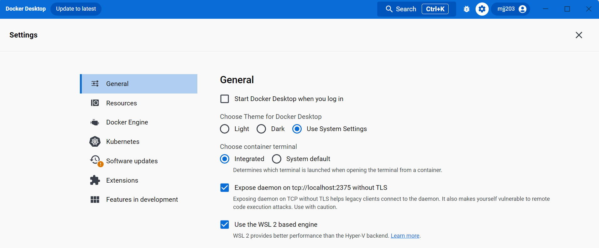

# Releasable Basemap Tiles (RBT)

The [AGC](https://www.agc.army.mil/) Releasable Basemap Tiles (RBT) prototype is important because the capability can be easily shared with international coalition partners and doesn’t need to go through the current approval process associated with traditional Limited Distribution (LIMDIS) data. The National System for Geospatial Intelligence (NSG) RBT prototype is based on modern technology and provides access to like in kind Standard Map Products such as Topographic Map (TM), Joint Operations Graphic (JOG), and Tactical Pilotage Chart (TPC) in Vector Tiles format. This format enables rapid transfer across a network or accessed offline from a tile cache.  By implementing simple changes in how modern maps are produced and accessed international coalition partners will be able to track plans and activities using the same basemaps as U.S. services without delays associated with release of classified information.

The RBT prototype is funded by [NGA](https://www.nga.mil/) and development, demonstration and enhancement will continue with the help of the Army Geospatial Enterprise [AGE](https://www.agc.army.mil/Army-Geospatial-Enterprise/About/) community, [GDIT](https://www.gdit.com), and [Axis Maps](https://www.axismaps.com/).

## Deploying with [TileserverGL](https://github.com/acalcutt/tileserver-gl#maplibre-tileserver-gl)
The RBT prototype is deployed as a containerized application using a modified version of [TileserverGL](https://hub.docker.com/repository/registry-1.docker.io/mjj203/rbt/tags?page=1&ordering=last_updated), that uses [MapLibre](https://maplibre.org/) instead of [MapboxGL](https://www.mapbox.com/mapbox-gljs), and enables EPSG:3395 projections for both WMTS and TileJSON endpoints. The `start.sh` script is an easy way to deploy the current config, styles, data, and fonts within this repo. Just clone this repo with [Git](https://git-scm.com/) to any linux or Windows WSL system with [Docker](https://www.docker.com/) installed, and run `./start.sh` within the root directory.

```
git clone https://github.com/mjj203/agc-rbt.git
cd rbt
./start.sh
```

### Setup Environment
Before cloning this repo you will need to ensure [Git](https://git-scm.com/downloads), [Git Large File Storage (LFS)](https://git-lfs.github.com/), and [Docker](https://docs.docker.com/get-docker/) are installed and enabled on your system. 

#### Install Git
Download and install [Git](https://git-scm.com/downloads) and [LFS](https://github.com/git-lfs/git-lfs/releases/tag/v3.3.0) for your OS. For Windows just download the [Git Windows Installer](https://github.com/git-for-windows/git/releases/download/v2.38.1.windows.1/Git-2.38.1-64-bit.exe) and [LFS Windows Installer](https://github.com/git-lfs/git-lfs/releases/download/v3.3.0/git-lfs-windows-v3.3.0.exe), then double click each starting with Git to run through the installation. Then open your Git Bash or Git Cmd terminal and execute `git lfs install`.

#### Install Docker
Download and install [Docker](https://docs.docker.com/get-docker/) for your OS. For windows ensure [Windows Subsystem for Linux](https://learn.microsoft.com/en-us/windows/wsl/) is installed by following [WSL](https://learn.microsoft.com/en-us/windows/wsl/install) for the latest Windows 10/11 or [Manual WSL](https://learn.microsoft.com/en-us/windows/wsl/install-manual) for older versions. Once WSL is enabled, then follow the [Windows install directions](https://docs.docker.com/desktop/install/windows-install/) and download the [installer](https://desktop.docker.com/win/main/amd64/Docker%20Desktop%20Installer.exe).

## LINUX SETUP
Install git for your distro.

### For FEDORA/RHEL/CENTOS:

```
sudo dnf remove docker docker-client \
    docker-client-latest docker-common \
    docker-latest docker-latest-logrotate \
    docker-logrotate docker-selinux \
    docker-engine-selinux docker-engine;
sudo dnf -y install dnf-plugins-core;
sudo dnf config-manager \
    --add-repo \
    https://download.docker.com/linux/fedora/docker-ce.repo;
sudo dnf install docker-ce docker-ce-cli \
    containerd.io docker-buildx-plugin \
    docker-compose-plugin git-all git-lfs;
git lfs install;
```

### For ubuntu/debian:

```
sudo apt-get remove docker docker-engine docker.io containerd runc;
sudo apt-get update;
sudo apt-get install ca-certificates curl gnupg lsb-release;
sudo update-ca-certificates; 
sudo mkdir -m 0755 -p /etc/apt/keyrings;
curl -fsSL https://download.docker.com/linux/ubuntu/gpg | sudo gpg --dearmor -o /etc/apt/keyrings/docker.gpg;
echo \
  "deb [arch=$(dpkg --print-architecture) signed-by=/etc/apt/keyrings/docker.gpg] https://download.docker.com/linux/ubuntu \
  $(lsb_release -cs) stable" | sudo tee /etc/apt/sources.list.d/docker.list > /dev/null
sudo chmod a+r /etc/apt/keyrings/docker.gpg;
sudo apt-get update;
sudo apt-get install \
    docker-ce docker-ce-cli containerd.io docker-buildx-plugin \
    docker-compose-plugin git-all git-lfs;
git lfs install;
```

## WINDOWS SETUP

Manual install of WSL2 using PowerShell as an admin:

```
dism.exe /online /enable-feature /featurename:Microsoft-Windows-Subsystem-Linux /all /norestart

dism.exe /online /enable-feature /featurename:VirtualMachinePlatform /all /norestart
```
Now restart your machine before proceeding to the next steps.

[Download the WSL2 Linux Kernel update](https://wslstorestorage.blob.core.windows.net/wslblob/wsl_update_x64.msi). Double-click to run - you will be prompted for elevated permissions, select ‘yes’ to approve this installation.

Open PowerShell as an admin and run:

```
wsl --set-default-version 2

curl.exe -L -o ubuntu-2204.appx https://aka.ms/wslubuntu2204

Add-AppxPackage .\ubuntu-2204.appx

wsl --set-version ubuntu-2204 2
```

Once you have installed WSL, you will need to create a user account and password for your newly installed Linux distribution. See the [Best practices](https://learn.microsoft.com/en-us/windows/wsl/setup/environment#set-up-your-linux-username-and-password) for setting up a WSL development environment guide to learn more.

Now install git and git-lfs in your WSL ubuntu distribution by opening the distro from the Windows Start Menu and running the below commands.

```
sudo apt update;
sudo apt upgrade -y;
sudo apt install git git-lfs;
git lfs install;
```
### Turn on Docker Desktop WSL 2

https://docs.docker.com/desktop/windows/wsl/

https://learn.microsoft.com/en-us/windows/wsl/tutorials/wsl-containers

First install Docker Desktop by [Downloading](https://desktop.docker.com/win/main/amd64/Docker%20Desktop%20Installer.exe) the latest version. Double click and follow the install instructions.

Next, start Docker Desktop from the Windows Start menu.

Select Settings and then General.

    Select the Use WSL 2 based engine and Expose daemon on tcp://localhost:2375 check boxes.
    

Now select Settings -> Resources -> WSL Integration.

    Select the Enable integration with my default WSL distro check box, and turn additional distros if desired.


To confirm that Docker has been installed, open your WSL distribution (e.g. Ubuntu) and display the version and build number by entering:

```
docker --version
```

From the WSL distribution you can now clone the repo and run the start script.

```
git clone https://github.com/mjj203/agc-rbt.git
cd rbt
./start.sh
```
